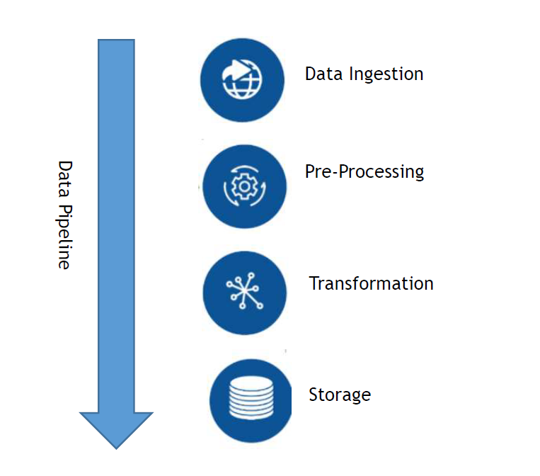

# Prescriber-Analytics

In this project we have developed a data pipeline in a way that it can be run automated starting with data ingestion, data preprocessing, data transform, data storage ,data persist and finally data transfer. It includes all the latest technologies.

#### Language and technologies
* Spark
* Python
* PyCharm
* HDFS
* Docker
* YARN 
* Google Cloud
* AWS
* Azure
* Hive
* PostgreSQL

### Operating System
* Linux
